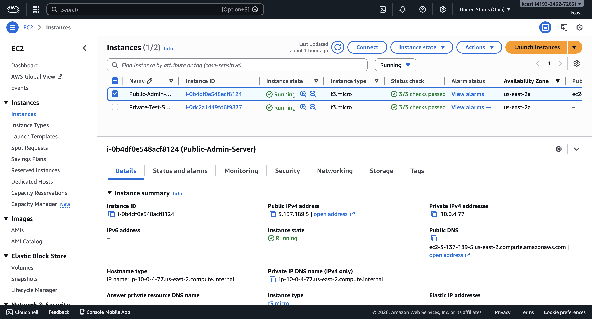
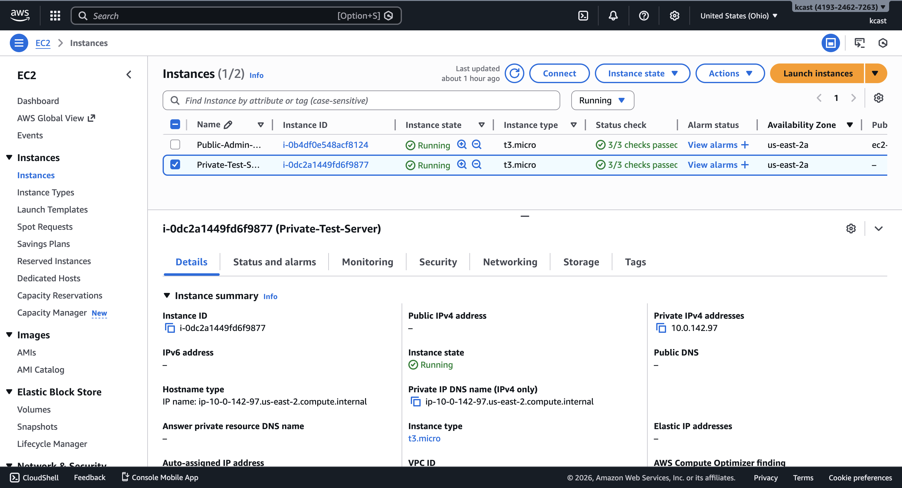
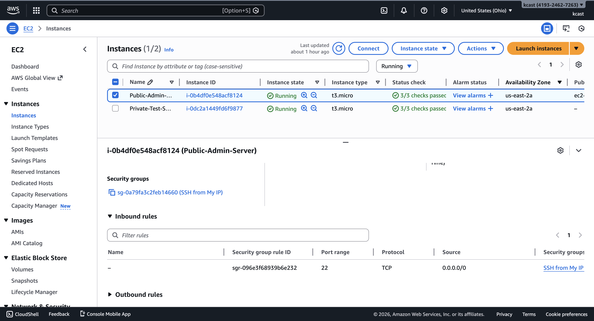
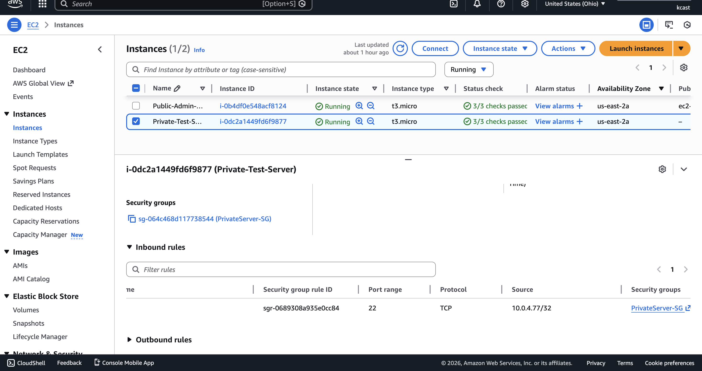
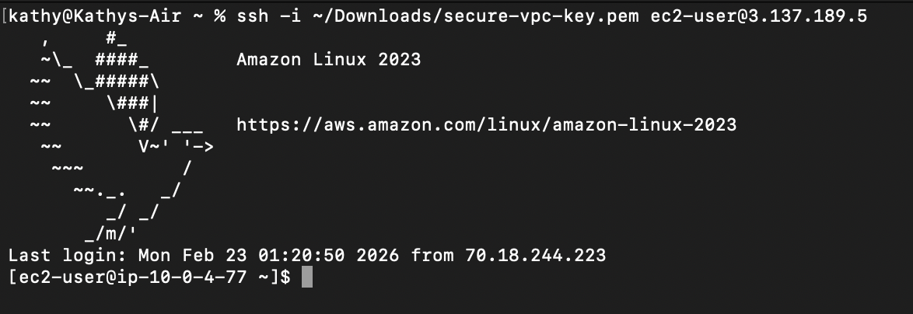
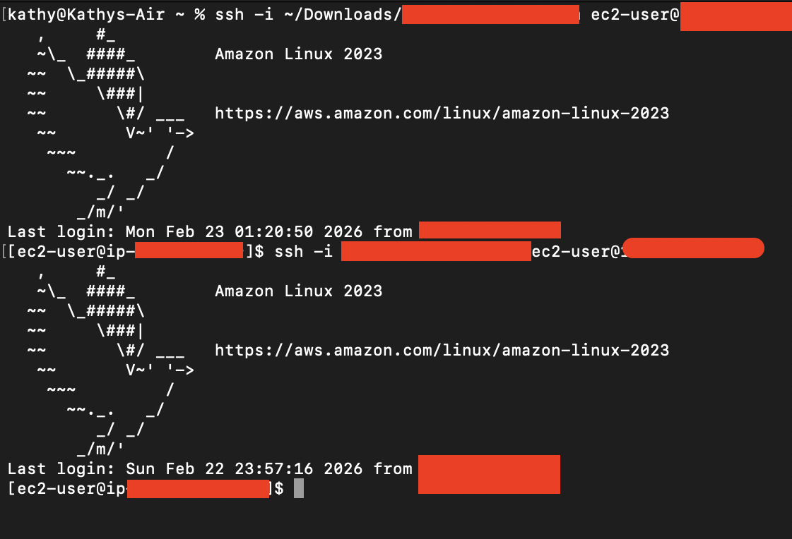
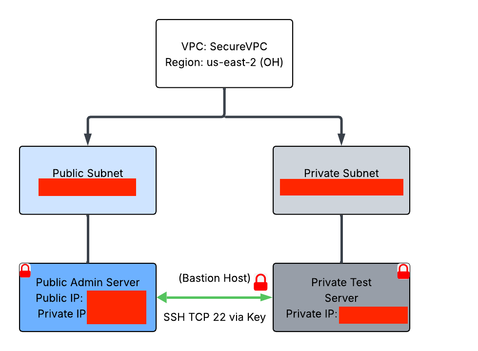

# Secure VPC Architecture Project

## Project Owner
- Kathy Castillo

## Overview
This project demonstrates as ecure VPC architecture in AWS, including:
- Public subnet with Public Admin Server
- Private subnet with Private Test Server
- Key-based SSH access
- Controlled network access via security groups
- Private server fully isolated from the internet

## Architecture Overview
- **VPC**: Secure VPC
- **Public Subnet**: Public Admin Server (accessible via SSH frm my computer)
- **Private Subnet**: Private Test Server (no public IP, accessible only via Public Admin Server)
- **Security Groups**:
- Public Admin Server: SSH only from my IP
-Private Test Server: SSH only from Public Admin Server private IP

## Resources Used
- **EC2 Instances**: t2.micro (Free Tier)
- **Security Groups**: PublicAdmin-SG, PrivateServer-SG
- **Key Pair**: secure-vpc-key.pem
- **Region**: us-east-2 (Ohio)

## Steps Completed
1. Created **VPC** with public and private subnets
2. Launched **Public Admin Server** in public subnet with auto-assigned public IP
3. Launched **Private Test Server** in private subnet
4. Configured **security groups** for controlled SSH access
5. Connected from **Computer → Public Admin Server → Private Test Server**
6. Verified **private server is isolated from internet**

## Key Commands

```bash
# Connect to public server
ssh -i ~/Downloads/secure-vpc-key.pem ec2-user@<Public-IP>
# Copy key to public server
scp -i ~/Downloads/secure-vpc-key.pem ~/Downloads/secure-vpc-key.pem ec2-user@<Public-IP>:/home/ec2-user/

# Set permissions on public server
chmod 400 secure-vpc-key.pem

# Connect from public server → private server
ssh -i secure-vpc-key.pem ec2-user@<Private-IP>








