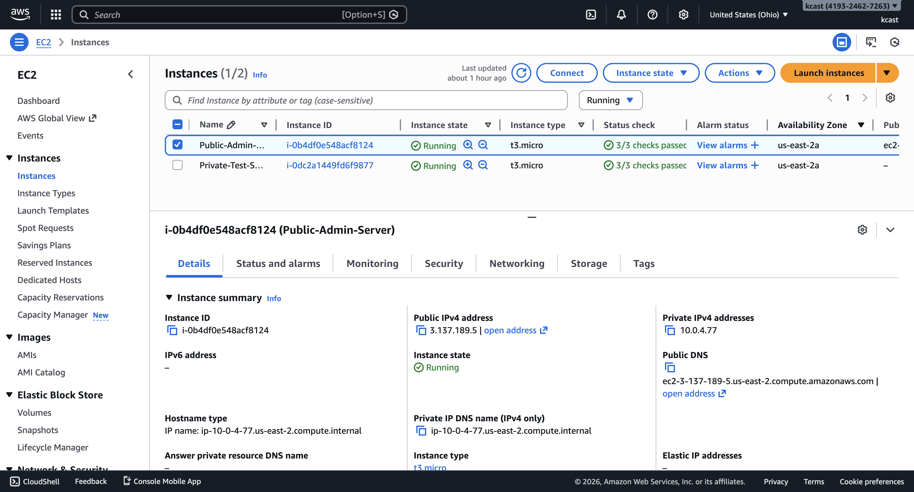
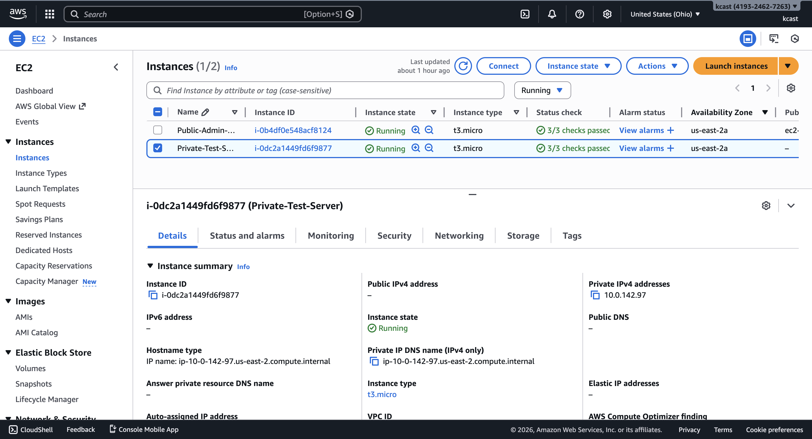
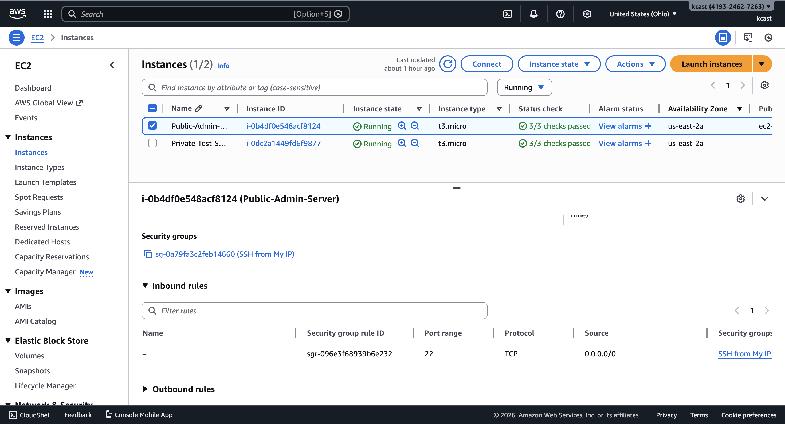
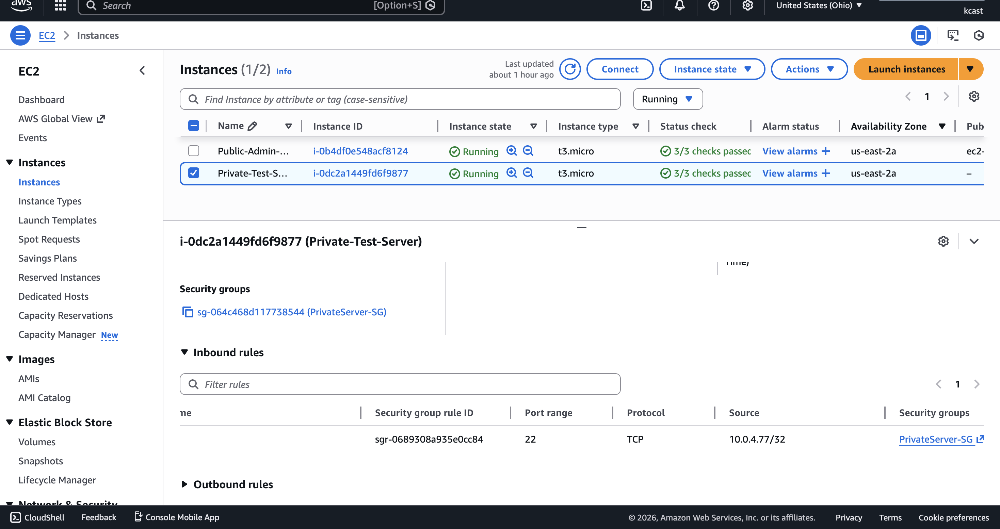
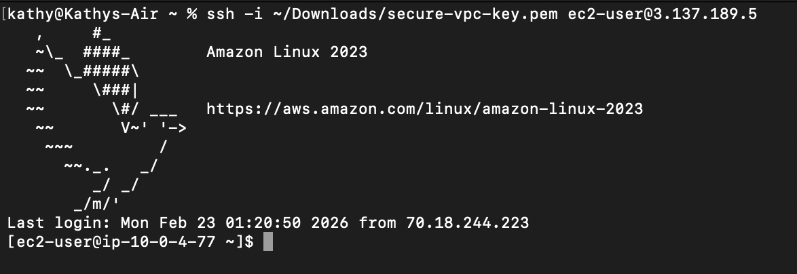
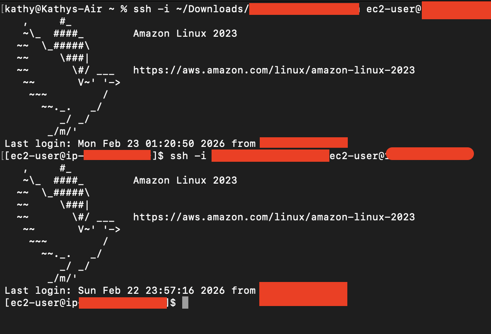
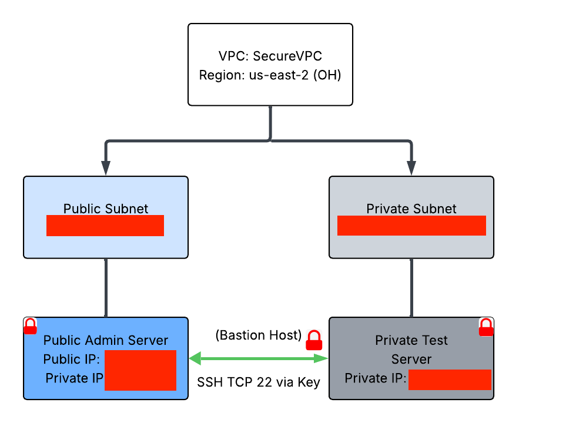

# Secure VPC Architecture Project
**Project Owner:** Kathy Castillo

## Overview
This project demonstrates a secure VPC architecture in AWS, including:
- Public subnet with a Public Admin Server (bastion host)
- Private subnet with a Private Test Server
- Key-based SSH access
- Controlled network access via security groups
- Private server isolated from the internet

## Architecture Overview
- **VPC:** Secure VPC
- **Public Subnet:** Public Admin Server (bastion host), accessible via SSH from my computer only
- **Private Subnet:** Private Test Server (no public IP), accessible only through the Public Admin Server
- **Security Groups:**
  - PublicAdmin-SG: SSH only from my IP
  - PrivateServer-SG: SSH only from the Public Admin Server's private IP

## Resources Used
- EC2 instances: t2.micro (Free Tier)
- Security groups: PublicAdmin-SG, PrivateServer-SG
- Key pair: secure-vpc-key
- Region: us-east-2 (Ohio)

## Steps Completed
1. Created a VPC with public and private subnets
2. Launched the Public Admin Server in the public subnet with an auto-assigned public IP
3. Launched the Private Test Server in the private subnet
4. Configured security groups for controlled SSH access
5. Connected from my computer → Public Admin Server → Private Test Server
6. Confirmed the private server has no public IP and restricted security group access.

## Verification
- Connected via SSH from my computer to the Public Admin Server, then from the Public Admin Server to the Private Test Server, confirming the intended access path worked.
- Confirmed by configuration that the Private Test Server has no public IP address and that PrivateServer-SG allows SSH only from the Public Admin Server's private IP, so it has no direct route from the internet.

## Key Commands (as originally built; see Security Improvements below)
```bash
# Connect to public server
ssh -i ~/Downloads/secure-vpc-key.pem ec2-user@<Public-IP>

# Copy key to public server (NOT recommended, see below)
scp -i ~/Downloads/secure-vpc-key.pem ~/Downloads/secure-vpc-key.pem ec2-user@<Public-IP>:/home/ec2-user/

# Set permissions on public server
chmod 400 secure-vpc-key.pem

# Connect from public server to private server
ssh -i secure-vpc-key.pem ec2-user@<Private-IP>
```

## Security Improvements (Lessons Learned)
In this build, I copied the private key onto the public admin server so I could SSH to the private server. On review, I recognized this as a risk: if the bastion host were compromised, an attacker would gain the key to the private server. In a future build, I would keep the key only on my local machine and connect using SSH ProxyJump or agent forwarding, so the key is never stored on an internet-facing host

## Screenshots









## Security Improvements (Lessons Learned)
In this build, I copied the private key onto the public admin server so I could SSH to the private server. On review, I recognized this as a risk: if the bastion host were compromised, an attacker would gain the key to the private server. In a future build, I would keep the key only on my local machine and connect using SSH ProxyJump (ssh -i key.pem -J ec2-user@<Public-IP> ec2-user@<Private-IP>) or agent forwarding, so the key is never stored on an internet-facing host. I would also add VPC Flow Logs for visibility and consider AWS Systems Manager Session Manager to remove the need for open SSH.

## Risk Assessment
See the full write-up: [Risk Assessment](Risk_Assessment.md)
